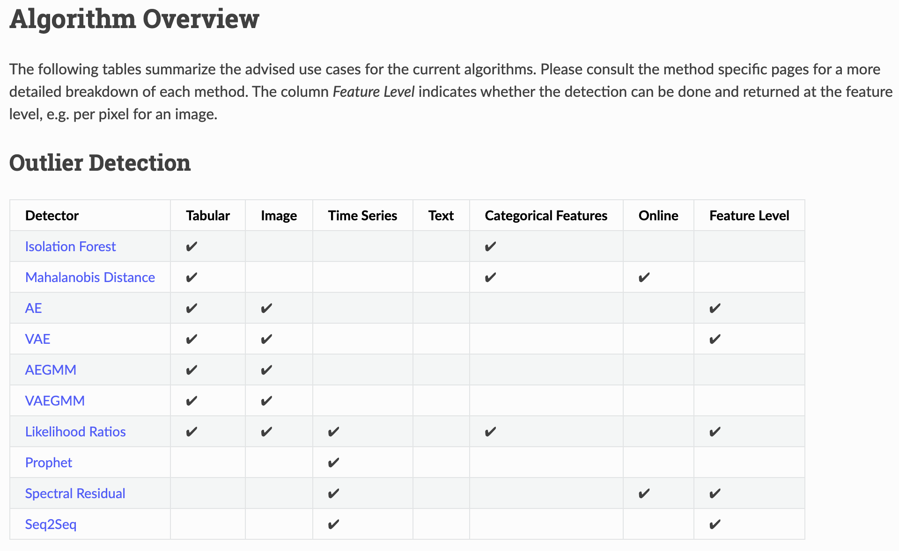

# Surface_Crack_Outlier_Detection
* `빵형의 개발도상국`님의 `표면의 결함을 알아내는 인공지능`을 리뷰하고 테스트 

## 내용
* 콘크리트 정상이미지만 학습시킨 뒤, 결함있는 이미지가 들어오면 찾아냄
* Outlier Detection을 VAE로 구현함

## 환경 셋팅
 * colab으로 연결

## 실행
### jupyter notebook
* [Surface_Crack_Outlier_Detection.ipynb](https://github.com/duc-ke/kaggle-playground-group/blob/main/9.Surface-Crack-Outlier-Detection/Surface_Crack_Outlier_Detection.ipynb)

## 결과

## 참고
VAE를 위해 해당 프로젝트에서 이용한 Alibi package의 Outlier Detection 지원내용
<table><tr><td>
    

</td></tr>
</table>

## Links
* [빵형 Outlier Detection(youtube)](https://youtu.be/RJ4oB6MWTsA)
* [콘크리트 데이터셋(kaggle)](https://www.kaggle.com/arunrk7/surface-crack-detection)
* [Alibi Detect](https://docs.seldon.io/projects/alibi-detect/en/latest/index.html)

